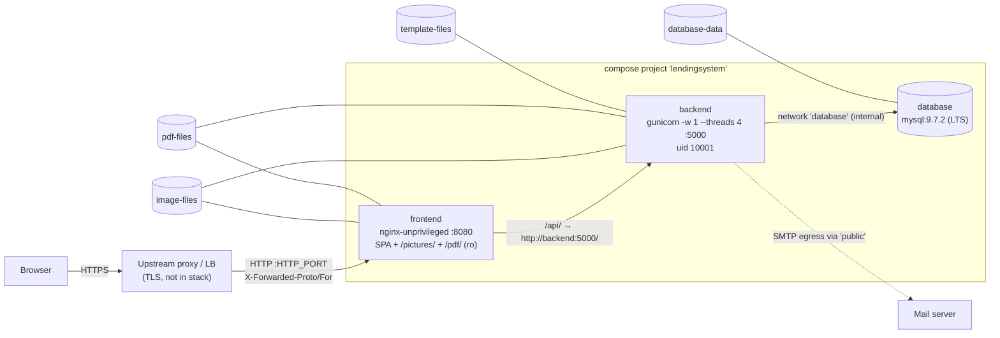

# DEPLOY-1 — Docker Compose production deployment: architecture

Status: accepted architecture, implemented on branch `feat/docker-compose-deployment` (base `main@58b5701`). Operator guide: [operations.md](operations.md).
Inputs: [requirements.md](requirements.md) (analysis baseline `a3c7c1e6…`) plus the project decisions of 2026-10-05. Where they differ, the decisions win:

- **H1** An existing deployment runs from the old `docker-compose.yml` (volumes `database-data`, `pdf-files`, `image-files`, `template-files`; `mysql:9.0.1`; backend logs in as MySQL `root`). It is migrated in place, stays on MySQL 9.x and is never downgraded.
- **H2** Minimal app changes are allowed (D2=b): relative frontend URLs, debug and GraphiQL off, configurable `SESSION_COOKIE_SECURE`, same-origin CORS, mail STARTTLS fix, local PDF worker.
- **H3** No TLS in the stack by default. An upstream reverse proxy or load balancer terminates TLS; the stack serves plain HTTP on one configurable port and honors `X-Forwarded-Proto`/`-For`. Let's Encrypt is an optional, documented upgrade.
- **H4** Defaults: single origin; manual backup and restore; no dev override; mail optional; keep `create_all` (Alembic is a follow-up); ship a placeholder image; only the HTTP entry port is published.

## 1. Topology

- Only `frontend` publishes a port: `${HTTP_PORT:-80}:8080`. `HTTP_PORT` also accepts `127.0.0.1:8080`, which was checked with `docker compose config`: the result is `host_ip: 127.0.0.1, published: 8080`.
- Networks keep their old names. `database` is `internal: true` and holds `database` and `backend`. `public` holds `frontend` and `backend`. The backend needs `public` for SMTP egress. The DB is no longer on `public` (fixes E2).
- Optional TLS overlay `compose.tls.yml` (§7): adds `caddy` on 80/443 and removes the frontend's published port with `ports: !reset []`.

## 2. Key decisions

| # | Decision | Rationale / evidence |
|---|----------|----------------------|
| K1 | `name: lendingsystem` pinned in compose; operator may override via `COMPOSE_PROJECT_NAME` in `.env` | The old project name came from the directory (a clone in `LendingSystem/` → `lendingsystem`). The env var overrides `name:`; this was verified with `docker compose config`, where `.env` `COMPOSE_PROJECT_NAME=oldproj` printed `name: oldproj`. The volume keys stay unchanged, so the old volumes `<project>_database-data` etc. are reused. |
| K2 | MySQL `mysql:9.7.2` (9.7 = LTS; Docker tag `lts` has the same digest `e2bde46d…`) | Stays on the 9.x line. The MySQL upgrade-path table allows "Innovation series → next LTS" in place. A local PoC upgraded a `mysql:9.0.1` volume to `9.7.2` in place: the log showed `Data dictionary upgrade from version '90000' to '90200' completed` and `Server upgrade from '90001' to '90702' completed`, and the data was intact. |
| K3 | App DB user `lending` (`MYSQL_USER`/`MYSQL_PASSWORD_FILE`), granted `ALL ON LendingSystem.*`; root password only for DB admin | Fixes E4. On fresh installs the image init creates the user. On upgraded installs, init does not re-run, so a manual SQL step creates it (§6, step 8; checked in the PoC). `ALL` on the schema is needed because of `create_all`, the APScheduler jobstore and the Flask-Session table. |
| K4 | Templates are baked into the backend image at `/backend/templates`. `template-files` stays mounted there. | Docker copy-up seeds a volume that is empty at mount time and leaves a non-empty one alone. The PoC confirmed this for fresh, pre-existing-empty and non-empty volumes. The old (empty, E6) volume is therefore filled automatically on upgrade, and operator-edited content is kept. Build uses compose `additional_contexts: templates: ./templates` plus `COPY --from=templates`, so the build context does not need to change. Caveat: later template changes in the repo do not reach an existing volume; see the ops doc. |
| K5 | nginx stays the only entry (D4=a). Config moves to a template (`/etc/nginx/templates/default.conf.template`, rendered with envsubst by the image entrypoint). | Envsubst is needed for `TRUSTED_PROXY_CIDR` (real IP). This is the official image mechanism and needs no extra code. |
| K6 | Forwarded headers. nginx: `set_real_ip_from ${TRUSTED_PROXY_CIDR}; real_ip_header X-Forwarded-For; real_ip_recursive on;` sends `X-Forwarded-For $remote_addr` (the real client). `X-Forwarded-Proto` = `$http_x_forwarded_proto` (`http`/`https` only) if the request comes from `TRUSTED_PROXY_CIDR` (`geo $realip_remote_addr`), else `$scheme` (`map`). Backend `ProxyFix(x_for=1, x_proto=1)` is unchanged. | Fixes E13. The backend sees exactly one hop (nginx). The backend never uses the client IP (no `remote_addr`/`access_route` in `backend/`); it matters for logs and the nginx rate limit. A client that reaches the port directly cannot spoof XFP. |
| K7 | LE upgrade is an override file `compose.tls.yml`, not a profile | A profile cannot remove the frontend's published port; an override can (`!reset`), so ports 80/443 stay free for Caddy. One small file; inline Caddyfile through `configs.content` (Compose ≥ 2.23.1). Merge verified with `docker compose config` (rc 0, ports 80/443/443-udp). |
| K8 | Backend stays `gunicorn -w 1` (N6), plus `--threads 4`, `--timeout 30`, `--access-logfile -` | One scheduler process. Threads keep one slow request from blocking all others; nginx buffers request bodies, so large uploads do not hold a thread while they arrive. |
| K9 | Non-root: backend uid/gid `10001`; frontend `nginxinc/nginx-unprivileged` (uid 101, port 8080); MySQL image default (drops to `mysql`) | N5. Upgraded upload volumes are root-owned by the old backend, so a one-off `chown` is needed (§6, step 9). |
| K10 | Secrets: files under `secrets/` (gitignored). The root password goes only to `database`; the app password goes to `database` and `backend`. | N3. On Linux, compose file secrets are bind mounts that keep host owner and mode, so uid 10001 needs `db-app-password.txt` to be `0644` inside a `0700` directory. Verified only on Docker Desktop; to be confirmed on a Linux host. |

## 3. File-by-file change list

| File | Change |
|------|--------|
| `docker-compose.yml` | Rewrite. `name: lendingsystem`. Logging anchor `x-logging` (json-file, `max-size: 10m`, `max-file: 3`) on all services. `restart: unless-stopped` on all services. **database**: `mysql:9.7.2`, no `ports`/`expose`, network `database` only, env `MYSQL_DATABASE=LendingSystem`, `MYSQL_ROOT_PASSWORD_FILE`, `MYSQL_USER=${DB_APP_USER:-lending}`, `MYSQL_PASSWORD_FILE`; secrets `db-root-password`, `db-app-password`; healthcheck `mysqladmin ping -h 127.0.0.1` (TCP: the init server runs `--skip-networking`, which fixes the E18 race), `start_period: 60s`. **backend**: build `./backend` + `additional_contexts: {templates: ./templates}`; `hostname: container`; `env_file: backend.env`; `environment:` pins the infrastructure keys (`database_host=database`, `database_port=3306`, `database_name=LendingSystem`, `database_user=${DB_APP_USER:-lending}`, `database_password=` (empty), `database_password_location=/run/secrets/db-app-password`, `root_directory=/backend/`, `picture_directory=pictures`, `pdf_directory=pdfs`, `template_directory=templates`; these override `env_file`); volumes unchanged (`pdf-files`, `image-files`, `template-files`); secret `db-app-password`; healthcheck `python -c "import urllib.request;urllib.request.urlopen('http://127.0.0.1:5000/health',timeout=3)"`; networks `database`, `public`; `depends_on: database: service_healthy`. **frontend**: build `./frontend`; `ports: ["${HTTP_PORT:-80}:8080"]`; env `TRUSTED_PROXY_CIDR=${TRUSTED_PROXY_CIDR:-127.0.0.1/32}`; volumes `pdf-files:/var/www/html/pdfs:ro`, `image-files:/var/www/html/pictures:ro`; healthcheck `wget -qO- http://127.0.0.1:8080/healthz`; `depends_on: backend: service_healthy`. Volumes: the same four keys. Secrets: `file: ${DB_ROOT_PASSWORD_FILE:-./secrets/db-root-password.txt}`, `${DB_APP_PASSWORD_FILE:-./secrets/db-app-password.txt}`. |
| `compose.tls.yml` (new) | §7. `frontend.ports: !reset []`, `frontend.environment.TRUSTED_PROXY_CIDR: 0.0.0.0/0` (only Caddy can reach the frontend); service `caddy: caddy:2.11.6-alpine`, ports `80:80`, `443:443`, `443:443/udp`, volumes `caddy-data:/data`, `caddy-config:/config`, `configs: caddyfile`, healthcheck `wget -qO- http://127.0.0.1:2019/config/` (admin API, localhost only), restart and logging as the others, network `public`. Inline Caddyfile: `{ email ${ACME_EMAIL:?} }` / `${DOMAIN:?} { encode gzip; reverse_proxy frontend:8080 }`. |
| `.env.example` (new) | §4.1 |
| `backend.env.example` (new) | §4.2 (replaces the README block). `git check-ignore` confirms that `*.env` does not match `*.env.example`. |
| `.gitignore` | Add `secrets/` and `compose.override.yml`. |
| `backend/Dockerfile` | `FROM python:3.12.15-slim`; `ENV PYTHONUNBUFFERED=1`; `COPY requirements.txt` first (layer cache); `apt-get install --no-install-recommends pkg-config default-libmysqlclient-dev build-essential`, then `pip install --no-cache-dir -r requirements.txt`, then purge `build-essential` in the same layer; `COPY . /backend/`; `COPY --from=templates . /backend/templates/`; copy placeholder `backend/static-seed/platzhalter_bild.png` (inside the backend build context) into `/backend/pictures/1741980710.2106326_platzhalter_bild.png` (seeds the `image-files` volume by copy-up, E8); `RUN useradd -u 10001 -U -M -d /backend app && mkdir -p pictures pdfs templates && chown -R 10001:10001 pictures pdfs templates`; `USER 10001`; `CMD gunicorn -w 1 --threads 4 --timeout 30 --access-logfile - -b 0.0.0.0:5000 app:app`. `requirements.txt` is UTF-8 (was UTF-16, E20) and pins gunicorn ≥ 23, which no longer needs `pkg_resources`/`setuptools`. |
| `backend/.dockerignore` | Unchanged (alembic stays excluded, D10). |
| `backend/config.py` | `app.debug = False` (was `True`). `SESSION_COOKIE_SECURE = os.getenv('session_cookie_secure','1') == '1'`; `SESSION_COOKIE_HTTPONLY=True`; `SESSION_COOKIE_SAMESITE='Lax'`. CORS: delete the wildcard; `CORS(...)` only if `cors_origins` (comma list) is set, otherwise no CORS headers (same origin). Fail fast if `secret_key` is empty (`raise SystemExit`). Remove `import redis` (unused, E20). |
| `backend/app.py` | `graphiql = os.getenv('graphiql','0') == '1'` instead of `True`. |
| `backend/sendMail.py` | `use_ssl == '1'` → `SMTP_SSL(..., context=ssl.create_default_context(), timeout=30)`; otherwise `SMTP(..., timeout=30)` + `starttls(context=…)`. Behavior change: the old code used implicit TLS for every `use_ssl` value, so port 465 now needs `use_ssl=1` (§6 step 6). If `mail_server_address` is empty: log "Mail disabled" with the subject only (no recipient) and return (no retry). Empty or missing `use_ssl` = STARTTLS (no `int()` crash, E14). The unbounded retry loop is unchanged (security review, §7.13). |
| `frontend/.env` (tracked) | `REACT_APP_BACKEND_URL=/api/graphql`, `REACT_APP_PICTURES_BASE_URL=/pictures/`, `REACT_APP_PDFS_BASE_URL=/pdf/`. |
| `frontend/src/components/requests/EditRequest.tsx:773` | `'http://192.168.178.169/pdfs/'` → `process.env.REACT_APP_PDFS_BASE_URL` (fixes the `/pdfs` vs `/pdf` mismatch). |
| `frontend/src/index.tsx:33`, `frontend/src/components/AGB/AGBPopUp.tsx:147` | `workerUrl='/pdf.worker.min.js'` (local, same origin). Drop the then-unused `pdfjsVersion`/`packageJson` imports where they become unused (ESLint). |
| `frontend/Dockerfile` | Build `FROM node:24.21.0-alpine`, `COPY package*.json` → `npm ci` → `COPY . .` → `cp node_modules/pdfjs-dist/build/pdf.worker.min.js public/` (guarantees worker = API version, today both 3.11.174) → `npm run build` with `GENERATE_SOURCEMAP=false` (no source in the image). Runtime `FROM nginxinc/nginx-unprivileged:1.30.5-alpine`; `COPY --from=build /app/build /usr/share/nginx/html`; `COPY nginx/default.conf.template /etc/nginx/templates/`; remove the `mkdir pdf/images` lines; `EXPOSE 8080`. |
| `frontend/nginx.conf` → `frontend/nginx/default.conf.template` | Server block only (the image's main config includes `conf.d`): `listen 8080`; `client_max_body_size 100m`; `server_tokens off`; real-IP (K6); `map $http_x_forwarded_proto $fwd_proto {default $http_x_forwarded_proto; "" $scheme;}` (in `http` context; template files land in `conf.d`, which is inside `http`, OK); `location = /healthz {access_log off; return 200 "ok";}`; `location / {root …; try_files $uri /index.html;}`; `location /api/ {proxy_pass http://backend:5000/; Host, X-Forwarded-For $remote_addr, X-Forwarded-Proto $fwd_proto; proxy_read_timeout 120s;}`; `location /pdf/ {alias /var/www/html/pdfs/;}`; `location /pictures/ {alias /var/www/html/pictures/;}`; **no autoindex**; `add_header X-Content-Type-Options nosniff` on the file locations. Note: envsubst touches every `$VAR` that is defined as an environment variable; the nginx variables (`$uri`, `$scheme`…) are not environment variables, so they survive (`NGINX_ENVSUBST_FILTER=TRUSTED_` to be explicit). |
| `backend/static-seed/platzhalter_bild.png` (new, small) | Neutral generated placeholder (E8, decision Q4). |
| `docs/deploy/operations.md` (new) | Operator guide: first deploy, upgrade from the old compose (§6), update, backup/restore (§8), LE (§7), template editing, troubleshooting. |
| `README.md` | Replace the `backend.env` block (incl. `Passw0rd!`) with a pointer to `docs/deploy/operations.md`. |

Not changed: `backend/app.py` schema/root-user bootstrap (D10), `hostname: container` mechanism, volume keys and network names.

## 4. Configuration contract

### 4.1 `.env` (compose interpolation; `.env.example` committed)

| Key | Default | Meaning |
|-----|---------|---------|
| `COMPOSE_PROJECT_NAME` | (commented) | Set only if the old deployment's volume prefix ≠ `lendingsystem` (§6, step 0). |
| `HTTP_PORT` | `80` | Published entry; `[ip:]port`, e.g. `127.0.0.1:8080` when the upstream proxy is on the same host. |
| `TRUSTED_PROXY_CIDR` | `127.0.0.1/32` | IP/CIDR of the upstream proxy whose `X-Forwarded-For` nginx trusts. |
| `DB_APP_USER` | `lending` | Backend DB user. Must not be `root` (the MySQL image rejects `MYSQL_USER=root`). |
| `DB_ROOT_PASSWORD_FILE` / `DB_APP_PASSWORD_FILE` | `./secrets/db-root-password.txt` / `./secrets/db-app-password.txt` | Secret file paths. |
| `COMPOSE_FILE` | (commented) `docker-compose.yml:compose.tls.yml` | Enables the LE overlay. |
| `DOMAIN`, `ACME_EMAIL` | (commented) | Only with `compose.tls.yml`. |

### 4.2 `backend.env` (app settings; `backend.env.example` committed, real file untracked, `chmod 600`)

| Key | Required | Note |
|-----|----------|------|
| `secret_key` | yes | `python3 -c "import secrets;print(secrets.token_hex(32))"`; the backend refuses to start if it is empty. |
| `root_user_name`, `root_user_password` | yes | Applied only when that user does not exist yet. No default password in the example. |
| `session_cookie_secure` | default `1` | `0` only for plain-HTTP smoke tests without TLS. |
| `mail_server_address`, `mail_server_port`, `use_ssl` (`1`=implicit TLS/465, else STARTTLS/587), `sender_email_address`, `sender_email_password` | optional | Empty server = mail disabled. Then password reset, reminders and status mails are not sent, and **a reset still changes the password**, which locks the user out (E14). Document this. |
| `graphiql` | default `0` | `1` = enable the GraphiQL UI. |
| `cors_origins` | default empty | Comma list; empty = same origin only. |
| `timezone` | ignored | Unused (E15). |

Keys set by compose `environment:` (§3) must not be needed in `backend.env`. If they are present (old file), compose's values win.

### 4.3 Secrets

- `secrets/db-root-password.txt` (DB only) and `secrets/db-app-password.txt` (DB + backend). Generate with `openssl rand -base64 32 | tr -d '/+=' > …`.
- `install -d -m 700 secrets`; `chmod 644 secrets/db-app-password.txt` (readable by uid 10001 inside the container; protected by the 0700 directory on the host). To be confirmed on a Linux host.
- No secret in images, build args or the repo. `frontend/.env` holds only relative URLs.

## 5. Health, restart, logging, non-root

| Service | Healthcheck | Start order | User |
|---------|-------------|-------------|------|
| database | `mysqladmin ping -h 127.0.0.1` (TCP), interval 10s, retries 10, start_period 60s | — | image (mysql) |
| backend | python urllib GET `/health`, interval 15s, start_period 30s | after database healthy | 10001 |
| frontend | `wget -qO- http://127.0.0.1:8080/healthz` | after backend healthy | 101 (nginx-unprivileged) |
| caddy (overlay) | `wget -qO- http://127.0.0.1:2019/config/` | after frontend healthy | image default |

All services: `restart: unless-stopped` and json-file logging with 10m×3.

## 6. Upgrade from the old compose (in place)

Old state: project = directory name, MySQL 9.0.1 runs as root with `db-password.txt` as the root password, and ports 3310, 5000, 80 and 443 are published.

0. **Identify the project name.** Run `docker volume ls | grep database-data`. The prefix before `_database-data` is the project name. If it is not `lendingsystem`, put `COMPOSE_PROJECT_NAME=<prefix>` into `.env`.
1. **Back up (mandatory; the 9.7 data dir cannot go back to 9.0).** Use the old stack while it is running: `docker compose exec -T database sh -c 'mysqldump -uroot -p"$(cat /run/secrets/db-password)" --single-transaction --routines --set-gtid-purged=OFF --databases LendingSystem' > backup-$(date +%F).sql`. Then tar the volumes (`image-files`, `pdf-files`, `template-files`) as in §8.
2. Run `docker compose down`. **Never use `-v`.**
3. Check out the new version.
4. Run `cp .env.example .env`. Set `HTTP_PORT` and `TRUSTED_PROXY_CIDR` (and `COMPOSE_PROJECT_NAME` from step 0).
5. Set up the secrets: `install -d -m 700 secrets && mv db-password.txt secrets/db-root-password.txt`, then generate `secrets/db-app-password.txt` (§4.3).
6. In `backend.env`, add `session_cookie_secure=1`, make sure `secret_key` is set, and remove the DB/path keys (optional; compose overrides them). If `mail_server_port` is 465, set `use_ssl=1` (the old code always used implicit TLS; the new one uses STARTTLS unless `use_ssl=1`).
7. Run `docker compose up -d database` and wait until it is `healthy`. MySQL upgrades the data dir in place from 9.0.1 to 9.7.2; check the log for `Server upgrade from '90001' to '90702' completed`.
8. Create the app user:
   `docker compose exec -T database sh -c 'mysql -uroot -p"$(cat /run/secrets/db-root-password)" -e "CREATE USER IF NOT EXISTS \`lending\`@\`%\` IDENTIFIED BY '"'"'$(cat /run/secrets/db-app-password)'"'"'; GRANT ALL PRIVILEGES ON \`LendingSystem\`.* TO \`lending\`@\`%\`;"'`
   `operations.md` has a copyable heredoc version.
9. Fix upload ownership (the old backend wrote files as root): `docker compose run --rm --no-deps --user root --entrypoint chown backend -R 10001:10001 /backend/pictures /backend/pdfs /backend/templates`.
10. Run `docker compose up -d --build` and confirm that `docker compose ps` shows all services healthy.
11. Repoint the upstream proxy from the old `:80/:443` to `HTTP_PORT` (plain HTTP). It must set `X-Forwarded-Proto: https` and `X-Forwarded-For`.
12. Verify A6–A8 (§10). Templates: if `template-files` was empty it is now seeded (K4). If it was not empty, check the imprint and privacy content. Placeholder: the old `image-files` volume is not empty, so copy-up does not seed it; add it only if missing (`docker compose exec backend test -e <path> || docker compose cp backend/static-seed/platzhalter_bild.png backend:<path>`, path `/backend/pictures/1741980710.2106326_platzhalter_bild.png`). Operators override the default with the same `docker compose cp` and their own image; it is never overwritten.

Rollback: stop the new stack, remove `database-data`, check out the old version, start `mysql:9.0.1` and restore the dump from step 1.

## 7. Let's Encrypt upgrade (optional overlay)

What is needed:
- A DNS A (and AAAA, if IPv6) record from `DOMAIN` to the host.
- Inbound TCP 80 and 443 (UDP 443 optional for HTTP/3) reachable from the internet, with nothing else bound to them. The overlay frees the frontend port.
- `ACME_EMAIL` (expiry notices) and `DOMAIN` in `.env`.
- Compose ≥ 2.23.1 (inline `configs.content`).

How to enable it:
1. In `.env`, set `COMPOSE_FILE=docker-compose.yml:compose.tls.yml`, `DOMAIN=lend.example.org` and `ACME_EMAIL=ops@example.org`.
2. Run `docker compose up -d`. Caddy obtains the certificate (HTTP-01/TLS-ALPN) and redirects HTTP to HTTPS. The certificates live in the `caddy-data` volume; back it up, because losing it means re-issuance and rate-limit risk.
3. `session_cookie_secure=1` (already the default).

Local smoke (quality gate "HTTPS, self-signed/internal allowed"): `DOMAIN=localhost`, any `ACME_EMAIL`. Caddy then uses its internal CA automatically; test with `curl -k https://localhost/`.

Not chosen: a Caddy compose profile, because it cannot unpublish the frontend port; and documentation only, because the overlay is about 25 lines and is testable by the gate.

## 8. Backup and restore (manual, D6=a)

- DB: run `mysqldump --single-transaction --routines --set-gtid-purged=OFF --databases LendingSystem` through `docker compose exec -T database` with the root secret (as in §6 step 1, but with secret `db-root-password`). Without `--set-gtid-purged=OFF` the restore fails with `ERROR 3546`.
- Files: `for v in image-files pdf-files template-files caddy-data; do docker run --rm -v ${P}_$v:/v:ro -v "$PWD":/b alpine:3.22 tar czf /b/$v.tgz -C /v .; done` (`P` = project name).
- Restore: `docker compose up -d database`, then `docker compose exec -T database sh -c 'mysql -uroot -p"$(cat /run/secrets/db-root-password)"' < backup.sql`. Untar into the volumes with `docker compose stop backend frontend` first. Then run the chown from §6 step 9 and `docker compose up -d`.

## 9. Decisions, open items, risks

- **Q1 (decided):** MySQL target `9.7.2` LTS.
- **Q2 (decided):** No new automated tests for the app changes; covered by the smoke checks A6, A7, A15–A17 plus a manual mail test when SMTP is available.
- **Q3 (decided):** The upgrade guide covers both cases (custom content and empty `template-files` volume).
- **Q4 (decided):** Ship a new neutral placeholder PNG as the default. Operators may override it; it is never overwritten (copy-up seeds only an empty volume; upgrades add it only if missing, see operations.md "Placeholder picture").
- Open: verify secret file readability for uid 10001 on a Linux host (K10); verified only on Docker Desktop.
- Verified: `location /api/` → `proxy_pass …/` maps `/api/graphql` to `/graphql` (A6).
- Risk: `frontend/.env` is tracked, so future secrets would leak (§7.14 of requirements). It now holds only relative paths; this is noted for the security review.
- Deferred to the security review: plaintext reset password mail, unbounded mail retry, SVG uploads, `secure_filename`, CSRF, and XFP spoofing when the port is reached directly (K6).

## 10. Verification mapping (A1–A14 adjusted for upstream TLS)

| ID | Check | Pass | Story |
|----|-------|------|-------|
| A1 | `cp .env.example .env; cp backend.env.example backend.env;` dummy secrets; `docker compose config -q`; also with `-f compose.tls.yml` and `DOMAIN`/`ACME_EMAIL` set | rc 0 (both) | S3, S4 |
| A2 | `docker compose build` | rc 0; ESLint warnings in touched files reported | S1, S2 |
| A3 | `docker compose up -d` on empty volumes; `docker compose ps` within 3 min | all `healthy` | S3 |
| A4′ | `curl -s -H 'X-Forwarded-Proto: https' http://127.0.0.1:$HTTP_PORT/api/graphql …` from a trusted IP; the backend sees https. Overlay: `curl -sI http://localhost/` | Overlay: 308 → https | S2, S4 |
| A5′ | `curl -s http://127.0.0.1:$HTTP_PORT/` and `/some/deep/link` | 200 SPA HTML. Overlay: `curl -sk https://localhost/` 200. Prod LE: issuer Let's Encrypt, SAN = `DOMAIN` (operator, pending) | S2, S4 |
| A6 | POST `{ getImprint }` to `/api/graphql` | 200, template content (templates seeded) | S1, S3 |
| A7 | Login mutation as root admin | `ok: true`; `Set-Cookie` has `Secure; HttpOnly; SameSite=Lax` | S1 |
| A8 | Upload a 5 MB picture (and a 20 MB one), then `GET /pictures/<name>` | 200, no 413 | S2, S3 |
| A9 | `docker compose ps` / `ss -tlnp` | only `HTTP_PORT` published (overlay: 80/443 only); nothing on 3306/3310/5000 | S3, S4 |
| A10 | `docker compose down && docker compose up -d` | data, uploads (and overlay certs) persist | S3, S4 |
| A11 | Backup and restore (§8) on a test instance | restored data visible | S5 |
| A12 | `docker compose exec frontend grep -rl 192.168 /usr/share/nginx/html` | no hits | S2 |
| A13 | `docker compose exec backend id -u`; `… frontend id -u` | 10001; 101 | S1, S2 |
| A14 | `docker compose down -v` | clean teardown | S6 |
| A15 | `GET /pictures/` and `GET /pdf/` (directory) | 403/404, no listing | S2 |
| A16 | `GET /api/graphql` with `Accept: text/html` | no GraphiQL page | S1 |
| A17 | Built bundle has no `unpkg.com`; a PDF opens in the UI (AGB popup) | grep 0 hits; viewer renders | S2 |
| A18 | Upgrade rehearsal: old compose at `58b5701` with `mysql:9.0.1` + sample data → §6 steps | data intact, login works, uploads writable, `template-files` seeded, placeholder `GET /pictures/1741980710.2106326_platzhalter_bild.png` 200 after step 12 | S6 |

## 11. Implementation stories

There is no tracker (`issue-tracker.md`), so these stories live in this doc and the PR description. One PR. Order: S1 ∥ S2 → S3 → S4 → S5 → S6.

**S1 — Backend production config and image** (always-S2: `backend/config.py`, Dockerfile)
- Outcome: the backend runs non-root on slim, with debug and GraphiQL off, a configurable secure cookie, same-origin CORS, working STARTTLS mail and templates baked in.
- Files: `backend/Dockerfile`, `backend/config.py`, `backend/app.py`, `backend/sendMail.py`.
- Acceptance: A2, A6, A7, A13 (backend), A16. With an empty `mail_server_address`, a reset logs "mail disabled" and does not crash. A missing `secret_key` exits non-zero with a clear message.
- Depends on: none (needs the `templates` additional context from S3 to build via compose; with plain `docker build`, pass `--build-context templates=../templates`).

**S2 — Frontend same-origin build and nginx**
- Outcome: a domain-independent image with relative URLs, a local PDF worker, unprivileged nginx on 8080, forwarded-header pass-through, no autoindex, 100 MB bodies.
- Files: `frontend/.env`, `EditRequest.tsx`, `index.tsx`, `AGBPopUp.tsx`, `frontend/Dockerfile`, `frontend/nginx/default.conf.template` (replaces `frontend/nginx.conf`).
- Acceptance: A2 (ESLint), A5′, A8, A12, A13 (frontend), A15, A17. A4′: the backend receives the forwarded proto. Check it, e.g., with the temporary log line `request.scheme` or through the `Secure` cookie, which is set either way. The nginx access log shows the client IP when the request comes from `TRUSTED_PROXY_CIDR`.
- Depends on: none.

**S3 — Compose rewrite, config examples, secrets**
- Outcome: one `docker compose up -d` gives a healthy 3-service stack that publishes only `HTTP_PORT` and is compatible with the old volumes and project name.
- Files: `docker-compose.yml`, `.env.example`, `backend.env.example`, `.gitignore`, `backend/static-seed/platzhalter_bild.png` (+ Dockerfile line in S1).
- Acceptance: A1, A3, A6, A9, A10. `git status` shows no secrets. The DB healthcheck is not healthy during init (log order).
- Depends on: S1, S2.

**S4 — Optional Let's Encrypt overlay**
- Outcome: `compose.tls.yml` plus `.env` switch gives automatic HTTPS with Caddy on 80/443; the frontend is unpublished.
- Acceptance: A1 (overlay), A4′/A5′ overlay with `DOMAIN=localhost` (internal CA), A9 overlay, A10 (`caddy-data` persists, no new issuance in the logs). Prod issuance by LE: pending, operator-owned. Pass criterion: the issuer is Let's Encrypt.
- Depends on: S3.

**S5 — Operator documentation**
- Outcome: `docs/deploy/operations.md` covers first deploy, the upgrade from the old compose (§6), update, backup/restore (§8), LE (§7), template editing (`docker compose cp`), mail optionality and lockout caveat. The README block is replaced.
- Acceptance: A11 executed following the doc. A doc reviewer can run §6 without asking questions.
- Depends on: S3, S4.

**S6 — Gate smoke and upgrade rehearsal**
- Outcome: quality-gate "Build and smoke" evidence on the final revision, plus the in-place upgrade rehearsal.
- Acceptance: A1–A18 recorded with commands, rc and revision; teardown A14; SonarQube per the gate.
- Depends on: S1–S5.

## Evidence index

- PoC MySQL 9.0.1 → 9.7.2 in-place (local Docker 29.8.1 / Compose v5.5.1, 2026-10-05): data kept, app user created, DDL as app user OK.
- PoC compose: `name:` overridden by `.env` `COMPOSE_PROJECT_NAME`; `!reset []` + inline `configs.content` merge rc 0; `${ACME_EMAIL:?}` missing → rc 1; `HTTP_PORT=127.0.0.1:8080` parses.
- PoC volume copy-up: fresh and pre-existing-empty volumes seeded; non-empty kept.
- Image tags verified on Docker Hub 2026-10-05: `mysql:9.7.2` (= `lts`), `caddy:2.11.6-alpine`, `nginxinc/nginx-unprivileged:1.30.5-alpine`, `node:24.21.0-alpine`, `python:3.12.15-slim`. Pin the digests at implementation time (optional).
- MySQL upgrade paths: <https://dev.mysql.com/doc/refman/9.7/en/upgrade-paths.html>.
